# Relatório de Testes - SpaceHub Backend

Este documento serve como relatório consolidado das rodadas de testes (Manuais e Automatizados) da plataforma SpaceHub. As evidências (imagens do Postman) estão salvas na pasta local `test_evidences/`.

## 1. Testes Automatizados E2E

A suíte de testes ponta a ponta (E2E) foi configurada utilizando o framework **Jest** com a biblioteca **Supertest**, verificando os principais fluxos de negócio diretamente no servidor NestJS integrado ao banco de dados Postgres no Supabase.

**Resultado:**
```bash
> jest --config ./test/jest-e2e.json

PASS test/app.e2e-spec.ts (41.713 s)
  AppController (e2e) e Fluxo Completo SpaceHub
    1. Fluxo de Autenticação
      √ deve registrar um usuário HOST 
      √ deve registrar um usuário GUEST 
    2. Fluxo de Espaços (Spaces)
      √ não deve permitir criar espaço como GUEST 
      √ deve criar um espaço como HOST 
    3. Fluxo de Reservas (Bookings)
      √ deve criar uma reserva no espaço criado 

Test Suites: 1 passed, 1 total
Tests:       5 passed, 5 total
Snapshots:   0 total
```

## 2. Testes Manuais (Evidências no Postman)

Antes da automatização, os fluxos foram exaustivamente validados de forma manual. Abaixo as evidências (screenshots) das respostas capturadas:

### 2.1 Registro e Login (Autenticação)
- **Criação de Host / Login e obtenção do Token:**
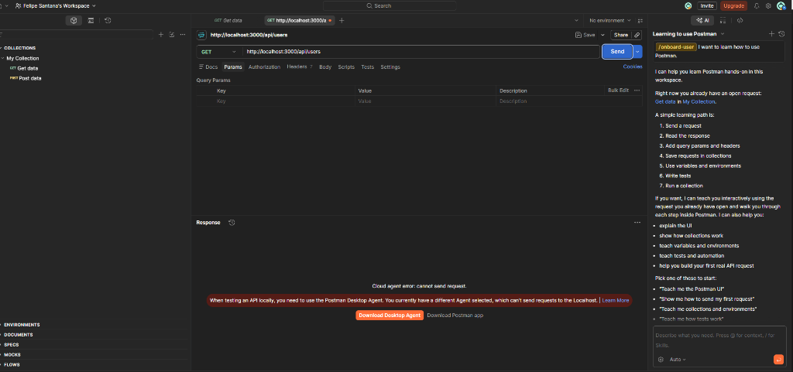
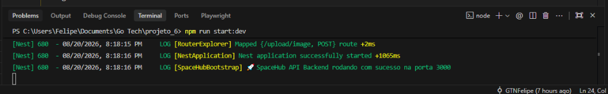

- **Criação de Guest e obtenção do Token:**
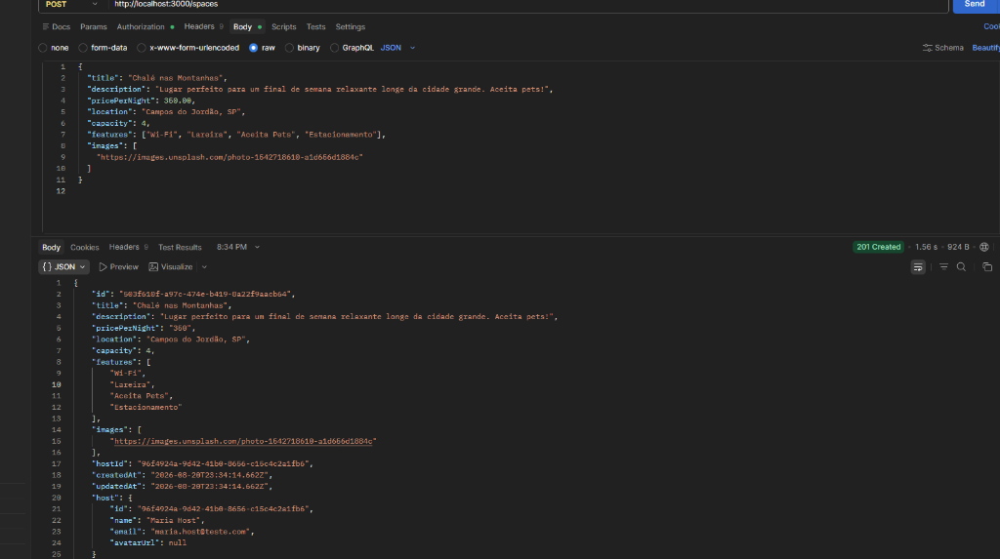

### 2.2 Criação e Validação de Espaços
- **Tentativa de criação de Espaço sem ser HOST (Bloqueado / 403 Forbidden):**
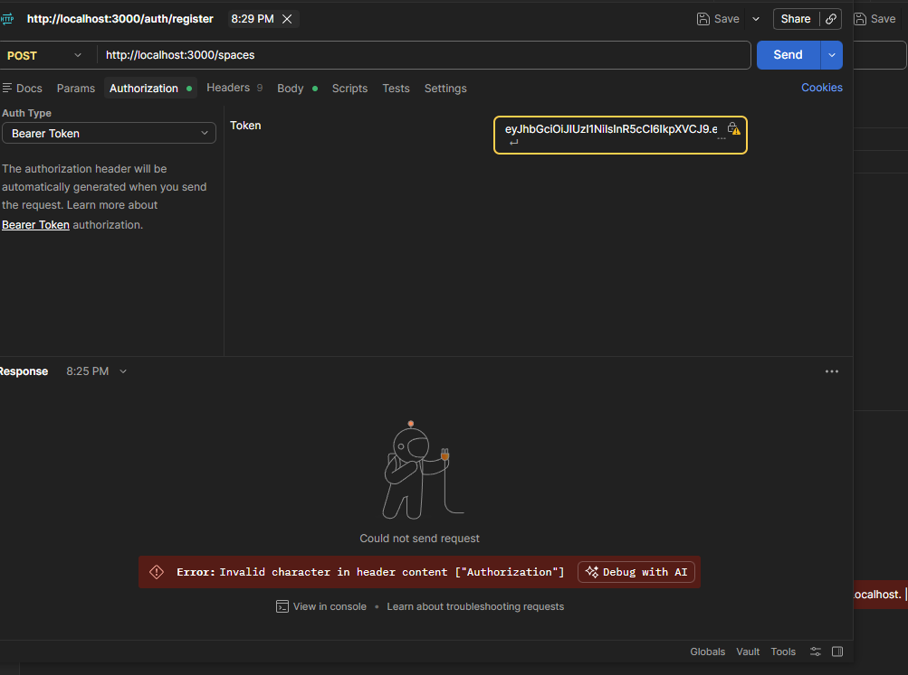

- **Criação de Espaço como HOST (Sucesso):**
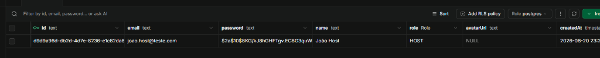

### 2.3 Reservas (Bookings) e Tratamento de Conflitos
- **Reserva de um espaço como Guest:**
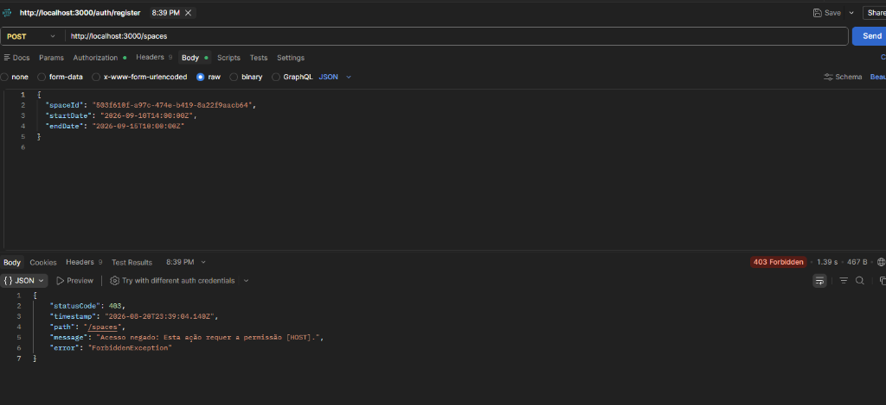

- **Cálculo automático do valor total (Preço por noite * Diárias):**
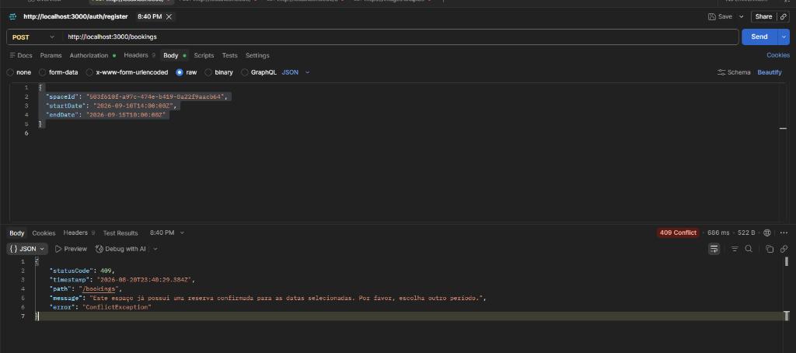

- **Tentativa de criação de reserva conflitante nas mesmas datas (Bloqueado / 409 Conflict):**
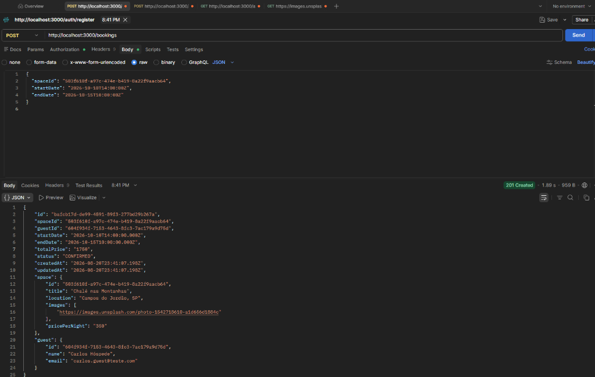

---
*Demais evidências de requisições capturadas:*
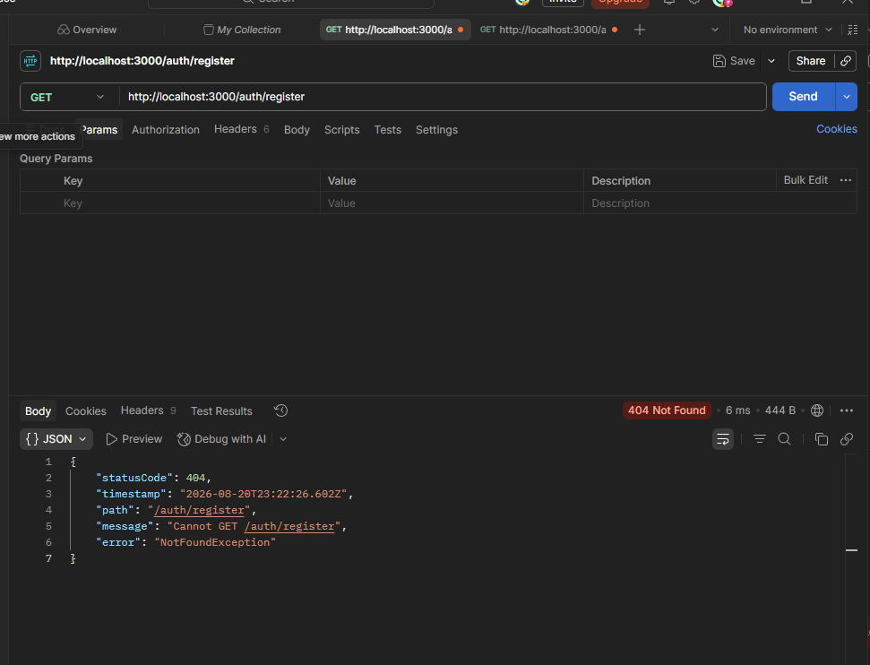
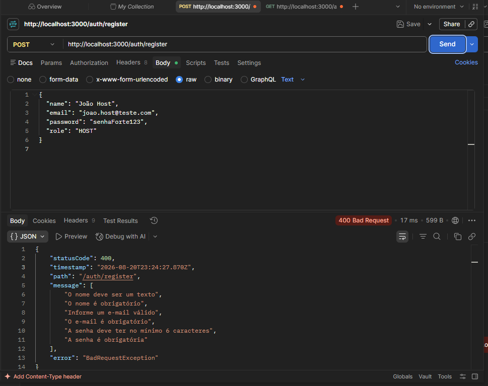
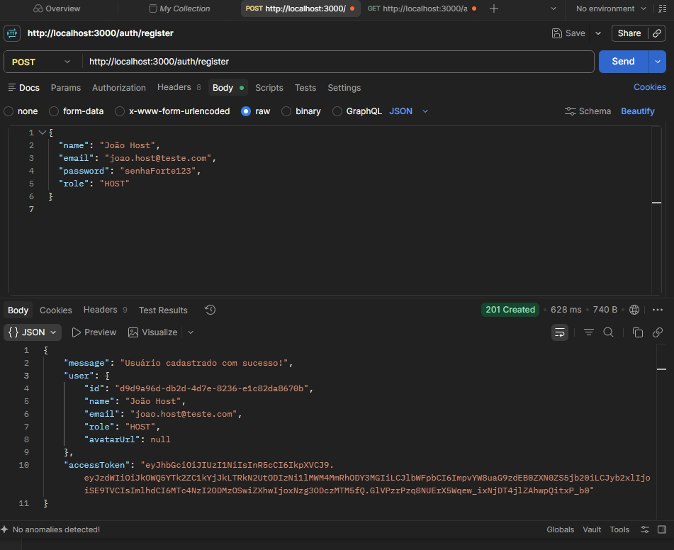
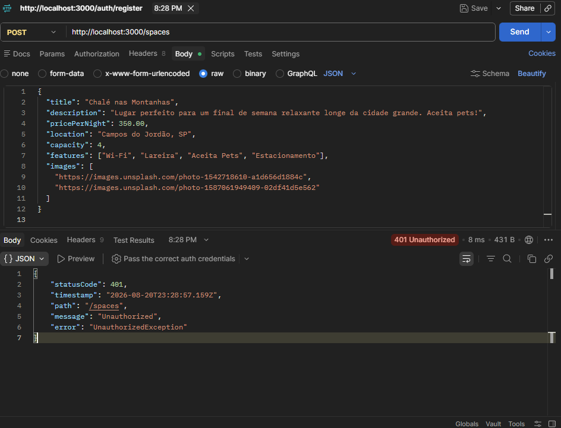
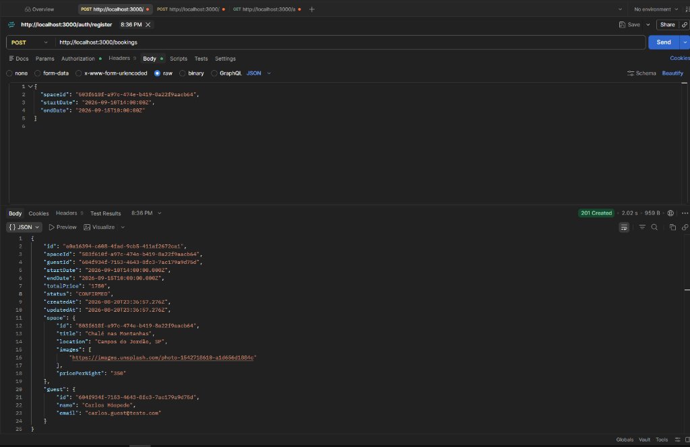

---
**Status Geral de Funcionalidades:** Aprovado ✅
